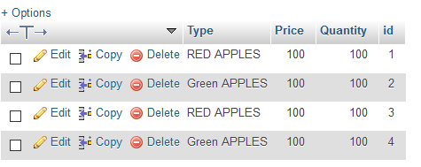
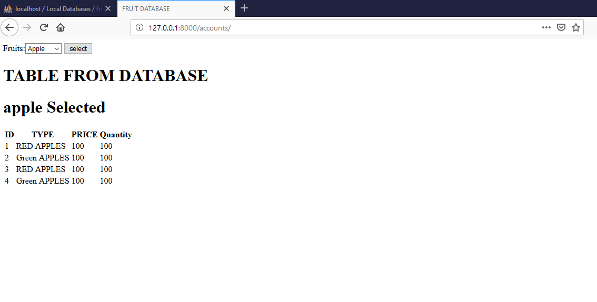

# Djano_app_mysql_basic
I have created basic Djano web page using mysql database from wamp apache server to recieve table from database.

                               HOW TO RUN:

I have sent zipped project, you just need to extract that anywhere in your PC. If you have all DJANGO and MYSQL setting installed then go to CMD and go to assignemt/tutorial in extracted folder and run on cmd: “ python manage.py runserver ” and all set.

NOTE: I have also given you sample database in fruits.sql file you can run in in MYSQL or WAMP and I have commented the code so I think it would be easy for you to understand it.

I am putting some samples under here.

Database tables structure:

All four tales Apples, Banana, Oranges and peaches have following structure:
 

Columns: TYPE , PRICE , Quantity , id

You can create your own database or run sql file to create this one.

Sample OUTPUT:

 
Please ask any other query.
